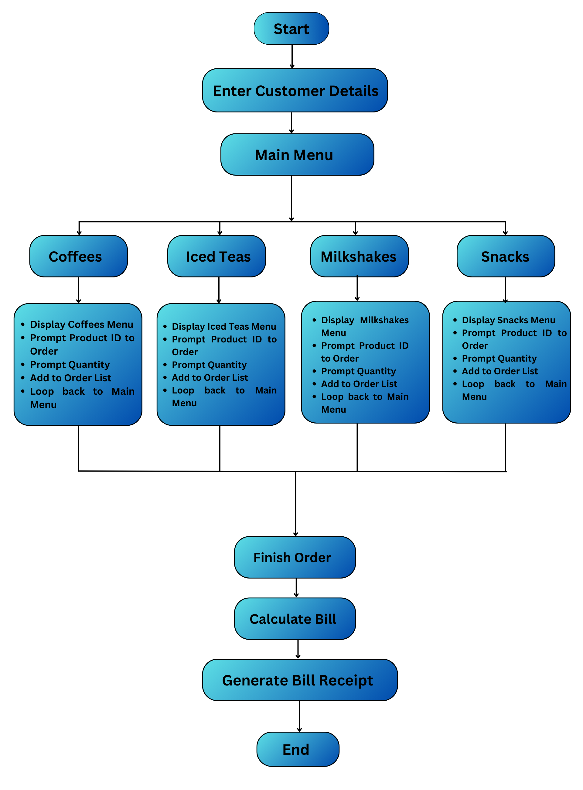

# BrewHub

**BrewHub** is a simple coffee shop management system implemented in Python and MySQL. It allows customers to place orders for various coffee drinks, teas, lemonades, milkshakes, and snacks, calculates the bill including tax, and generates a receipt.
To grasp the concept more clearly, refer to the flowchart below.

</p

## Features

- Customer Management: Capture customer details such as name, contact number, and email.
- Menu Selection: Choose from a variety of coffee drinks, teas, lemonades, milkshakes, and snacks.
- Order Processing: Calculate subtotal, tax (2% GST), and total amount.
- Bill Generation: Generate a detailed bill receipt with ordered items, quantities, prices, and total amount.
- Database Integration: Store customer information, orders, and order items in a MySQL database.

## Requirements

Before running BrewHub, make sure you have the following installed:

- Python 3.8 or higher
- MySQL
- Required Python libraries: mysql-connector-python

## Contribution
Contributions are welcome! If you encounter any issues or have suggestions for improvements, feel free to open an issue or submit a pull request.
